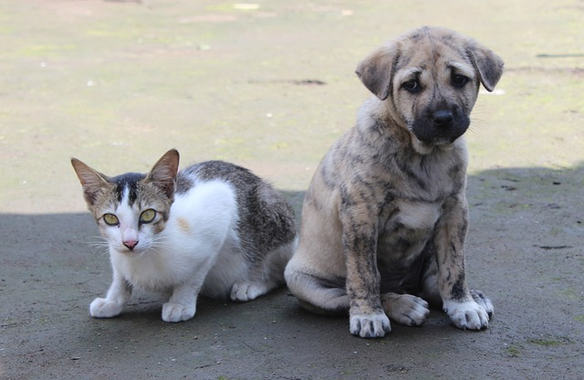
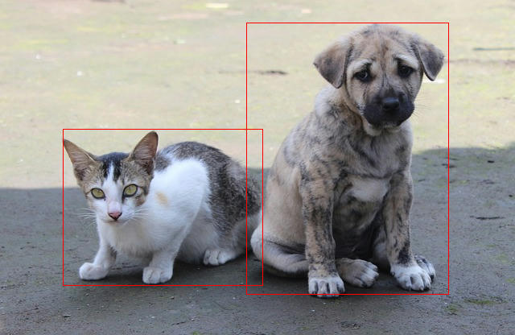

<div align="center">
  <h1><code>mediapipe-rs</code></h1>
  <p>
    <a href="https://github.com/yanghaku/mediapipe-rs/actions?query=workflow%3ACI">
      
    </a>
    <a href="https://crates.io/crates/mediapipe-rs">
      
    </a>
    <a href="https://docs.rs/mediapipe-rs">
      
    </a>
  </p>
</div>

# A Rust library for mediapipe tasks for WasmEdge WASI-NN

## Introduction

* **Easy to use**: low-code APIs such as mediapipe-python.
* **Low overhead**: No unnecessary data copy, allocation, and free during the processing.
* **Flexible**: Users can use custom media bytes as input, such as ```ndarray```.
* For TfLite models, the library not only supports all models downloaded from [MediaPipe Solutions] but also supports
  **[TF Hub]** models and **custom models** with essential information.
* Support **multiple model formats**, such as TfLite, PyTorch, and Onnx.
  The library can **detect it when loading models**.

## Examples

### Image classification

```rust
use mediapipe_rs::tasks::vision::ImageClassifierBuilder;

fn main() -> Result<(), Box<dyn std::error::Error>> {
    let (model_path, img_path) = parse_args()?;

    let classification_result = ImageClassifierBuilder::new()
        .model_asset_path(model_path) // set model path
        .max_results(4) // set max result
        .finalize()? // create a image classifier
        .classify(&image::open(img_path)?)?; // do inference and generate results

    // show formatted result message
    println!("{}", classification_result);

    Ok(())
}
```

### Object Detection

```rust
use mediapipe_rs::postprocess::utils::draw_detection;
use mediapipe_rs::tasks::vision::ObjectDetectorBuilder;

fn main() -> Result<(), Box<dyn std::error::Error>> {
    let (model_path, img_path, output_path) = parse_args()?;

    let mut input_img = image::open(img_path)?;
    let detection_result = ObjectDetectorBuilder::new()
        .model_asset_path(model_path) // set model path
        .max_results(2) // set max result
        .finalize()? // create a object detector
        .classify(&input_img)?; // do inference and generate results

    // show formatted result message
    println!("{}", detection_result);

    if let Some(output_path) = output_path {
        // draw detection result to image
        draw_detection(&mut input_img, &detection_result);
        // save output image
        input_img.save(output_path)?;
    }

    Ok(())
}
```

Example input:


Example output:


### GPU and TPU support

The default device is CPU, and user can use APIs to choose device to use:

```rust
use mediapipe_rs::tasks::vision::ObjectDetectorBuilder;

fn create_gpu(model_blob: Vec<u8>) {
    let detector_gpu = ObjectDetectorBuilder::new()
        .model_asset_buffer(model_blob)
        .gpu()
        .finalize()
        .unwrap();
}

fn create_tpu(model_blob: Vec<u8>) {
    let detector_tpu = ObjectDetectorBuilder::new()
        .model_asset_buffer(model_blob)
        .tpu()
        .finalize()
        .unwrap();
}
```

## Related Links

- [LFX Workspace: A Rust library crate for mediapipe models for WasmEdge NN](https://github.com/WasmEdge/WasmEdge/issues/2355)
- [WasmEdge]
- [MediaPipe]
- [wasi-nn safe]
- [wasi-nn specification]
- [wasi-nn]

[wasi-nn]: https://github.com/bytecodealliance/wasi-nn

[wasi-nn specification]: https://github.com/WebAssembly/wasi-nn/

[wasi-nn safe]: https://github.com/yanghaku/wasi-nn-safe

[WasmEdge]: https://github.com/WasmEdge/WasmEdge

[MediaPipe]: https://github.com/google/mediapipe

[MediaPipe Solutions]: https://developers.google.com/mediapipe/solutions/

[TF Hub]: https://tfhub.dev/

## License

This project is licensed under the Apache 2.0 license. See [LICENSE] for more details.

[LICENSE]: LICENSE
